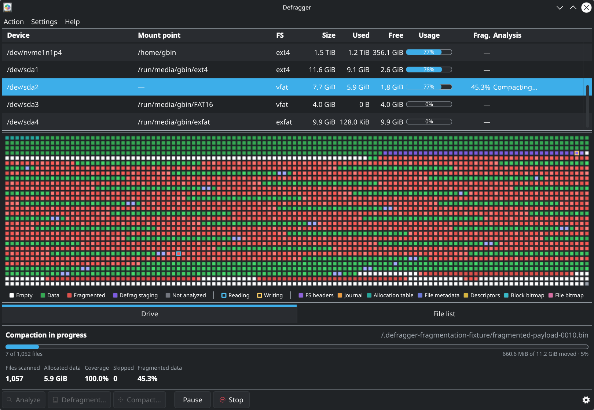

# Defragger

[](#license)
[](https://www.rust-lang.org/)
[](https://kernel.org/)




Defragger is a Linux filesystem analyzer and defragmenter with a Qt
Quick/Kirigami interface and a command-line client. It shows how files and free
space are laid out on a volume, identifies fragmented files, and can reorganize
supported filesystems without calling tools such as `e4defrag` or `filefrag`.

## What it does

- Analyzes fragmentation and displays an adaptive filesystem block map.
- Defragments ext4 files and offline FAT16/FAT32 volumes.
- Compacts offline FAT16/FAT32 volumes by moving data toward the start of the
  filesystem.
- Uses PolicyKit for operations that need elevated access while keeping the GUI
  and CLI unprivileged.
- Supports safe cancellation and reports progress and final metrics.

## Supported environment

Defragger runs on Linux with Qt 6 and KDE Kirigami. KDE Plasma is the primary
desktop target, but the project is not specific to Arch Linux. Privileged mode
requires systemd, PolicyKit, and an active graphical PolicyKit agent.

| Filesystem | Analysis | Defragmentation / compaction |
| --- | --- | --- |
| ext4 | Mounted or offline | Supported |
| FAT16/FAT32 | Mounted or offline | Offline volumes only |
| FAT12 | Mounted or offline | Analysis only |
| exFAT | Mounted | Analysis only |

The build requires Rust 1.85 or newer, CMake 3.24 or newer, Qt 6 Base and
Declarative, Kirigami, a Qt Quick Controls desktop style, PolicyKit, and a C++
toolchain. Package names vary by distribution.

## Run from source

The default development build uses a transient systemd helper and prompts for
authorization through PolicyKit; it does not need to be installed first.

```sh
cargo run --release
# or
just run
```

Run without the privileged helper when systemd or PolicyKit is unavailable:

```sh
cargo run --release --no-default-features
```

The CLI accepts device paths, mount points, device symlinks, and loop-image
paths:

```sh
cargo run --release -p defragger-cli -- list
cargo run --release -p defragger-cli -- analyze /dev/nvme0n1p2
cargo run --release -p defragger-cli -- defrag /dev/nvme0n1p2 --yes
cargo run --release -p defragger-cli -- compact /dev/sdb1 --yes
```

## System-wide installation

```sh
cmake -S . -B build -DCMAKE_BUILD_TYPE=Release -DCMAKE_INSTALL_PREFIX=/usr
cmake --build build
sudo cmake --install build
sudo systemctl daemon-reload
```

This installs the application, CLI, root-owned D-Bus helper, systemd service,
and PolicyKit actions. See the [architecture notes](docs/architecture.md) for
the privilege boundaries and implementation details.

## License

Copyright 2026 Guillaume Binet.

Defragger is dual-licensed under the [MIT License](LICENSE-MIT) or the
[Apache License 2.0](LICENSE-APACHE), at your option.

Third-party components and assets remain under their respective licenses. In
particular, the application icon is from KDE's Breeze Icons project; see its
[attribution and licensing details](packaging/ICON_ATTRIBUTION.md).
